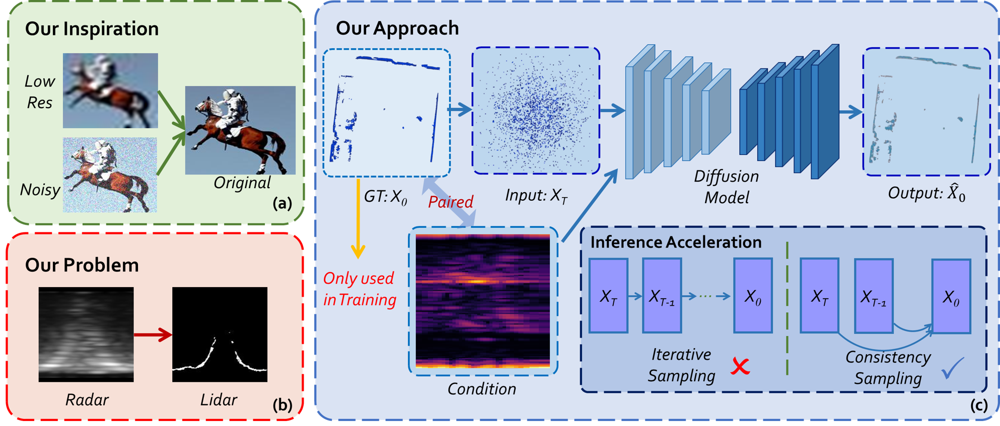

# Radar-Diffusion: Towards Dense and Accurate Radar Perception Via Efficient Cross-modal Diffusion Model
# News
- 25 June, 2024: Paper accepted by  _IEEE Robotics and Automation Letters (RA-L)_ !
- 27 July, 2024: Code and pre-trained models released!
# TODO
- [x] Release training and testing code for Radar-Diffusion.
- [x] Release pre-trained models.
- [x] Release user guide. 
- [x] Release data pre-processing code.
- [ ] Release performance evaluation code.

# Introduction

This repository contains the source code and pre-trained models of **Radar-Diffusion** described in our paper "Towards Dense and Accurate Radar Perception Via Efficient Cross-modal Diffusion Model." accepted by  _IEEE Robotics and Automation Letters (RA-L)_, 2024.

__Authors__: [Ruibin Zhang](https://github.com/RoboticsZhang)<sup>\*</sup>, [Donglai Xue](https://github.com/dungloi)<sup>\*</sup>, [Yuhan Wang](https://github.com/johannwyh), [Ruixu Geng](https://github.com/ruixv), and [Fei Gao](http://zju-fast.com/fei-gao/) ( <sup>\*</sup> equal contributors )

__Paper__: [arXiv](https://arxiv.org/abs/2403.08460), [IEEE Early Access](https://github.com/ZJU-FAST-Lab/Radar-Diffusion)

__Supplementary Video__: [YouTube](https://www.youtube.com/watch?v=Q3S-9w3dGV4&t=13s), [Bilibili](https://www.bilibili.com/video/BV1eK421b76M/?spm_id_from=333.337.search-card.all.click).

<a href="https://www.youtube.com/watch?v=Q3S-9w3dGV4&t=13s" target="blank">
  <p align="center">
    
  </p>
</a>

_Abstract_: Millimeter wave (mmWave) radars have attracted significant attention from both academia and industry due to their capability to operate in extreme weather conditions. However, they face challenges in terms of sparsity and noise interference, which hinder their application in the field of
micro aerial vehicle (MAV) autonomous navigation. To this end, this paper proposes a novel approach to dense and accurate mmWave radar point cloud construction via cross-modal learning. Specifically, we introduce diffusion models, which possess state-of-the-art performance in generative modeling, to
predict LiDAR-like point clouds from paired raw radar data. We also incorporate the most recent diffusion model inference accelerating techniques to ensure that the proposed method can be implemented on MAVs with limited computing resources. We validate the proposed method through extensive benchmark comparisons and real-world experiments, demonstrating its superior performance and generalization ability..


# User Guide

## Quick Start
```sh
git clone https://github.com/ZJU-FAST-Lab/Radar-Diffusion.git
cd diffusion_consistency_radar
pip install -e .
sh launch/inference_cd_example_batch.sh
```
The above script runs consistency inference in **only 1 step** using the pre-trained checkpoint. After that, you can find the predicted results and Ground-Truth LiDAR bev point clouds in diffusion_consistency_radar/inference_results .

## Dataset Pre-processing
1. First, download the [Coloradar dataset](https://o365coloradoedu-my.sharepoint.com/personal/chhe5305_colorado_edu/_layouts/15/onedrive.aspx?ga=1&LOF=1&id=%2Fpersonal%2Fchhe5305%5Fcolorado%5Fedu%2FDocuments%2FColoRadar%2Fkitti).
2. Unzip all the subsequences in a folder, then run: 
```
python Coloradar_pre_processing/generate_coloradar_timestamp_index.py
```
3. Install [patchwork++](https://github.com/url-kaist/patchwork-plusplus.git) by running:
```
cd Coloradar_pre_processing/patchwork-plusplus
pip install -e .
``` 
4. Generate pre-processed dataset by running:
```
python Coloradar_pre_processing/dataset_generation_coloradar.py
``` 

## Train and test Radar-Diffusion
1. Train a regular EDM model:
```
sh diffusion_consistency_radar/launch/train_edm.sh 
``` 
2. Distill a CD model from the above EDM model:
```
sh diffusion_consistency_radar/launch/train_cd.sh 
``` 
3. Inference from an EDM model:
```
sh diffusion_consistency_radar/launch/inference_edm.sh
``` 
3. Inference from a CD model in one step:
```
sh diffusion_consistency_radar/launch/inference_cd.sh
``` 

# Licence
The source code is released under [MIT](https://en.wikipedia.org/wiki/MIT_License) license.

# Acknowledgments
1. The diffusion-consistendy model code is heavily based on [consistency_models](https://github.com/openai/consistency_models.git).
2. The radar pre-processing code is heavily based on [azinke/coloradar](https://github.com/azinke/coloradar).

# Cite
If you find this method and/or code useful, please consider citing
~~~
@article{zhang2024towards,
  title={Towards Dense and Accurate Radar Perception Via Efficient Cross-Modal Diffusion Model},
  author={Zhang, Ruibin and Xue, Donglai and Wang, Yuhan and Geng, Ruixu and Gao, Fei},
  journal={arXiv preprint arXiv:2403.08460},
  year={2024}
}
~~~

